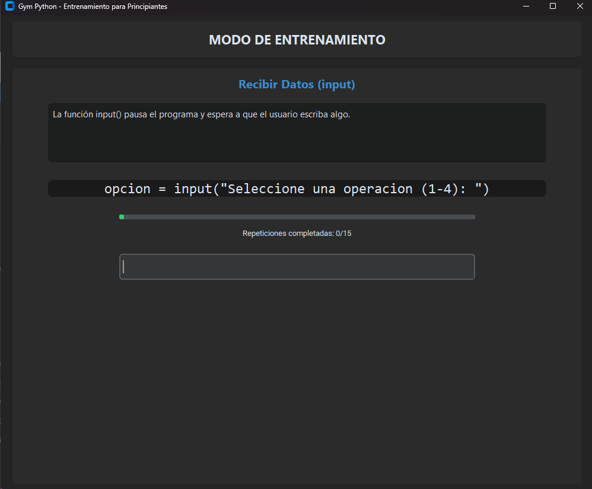

# Python Gym: Muscle Memory Trainer

Professional muscle memory trainer designed to master Python syntax through guided repetition.

---

## Overview

Python Gym is a specialized training application built to bridge the gap between theoretical knowledge and practical coding. By focusing on muscle memory, it helps beginners internalize the most common Python symbols and commands such as comments, print functions, variable assignment, and flow control. The application provides a modern, distraction-free environment to ensure that fundamental syntax becomes second nature.

---

## Visual Preview

(A screenshot of the application should be placed in the assets folder)
> 

---

## Key Features

- Structured Progress: Real-time progress bars tracking completion of each module.
- Modern GUI: A professional windowed interface built with CustomTkinter, eliminating terminal dependency.
- Technical Context: Each exercise is accompanied by an explanation of how the code interacts with system memory and the processor.
- Integrated Execution Environment: A final testing stage where users can write and execute their own code within the application.
- Efficiency Shortcut: Use the 'cd..' command to bypass repetitions for mastered concepts.

---

## Installation and Usage

### Standalone Executable
1. Navigate to the Releases section of this repository.
2. Download the latest version of Gym_Python_Final_GUI.exe.
3. Run the executable on Windows. No Python installation is required for this version.

### Source Code
1. Clone the repository:
   ```bash
   git clone https://github.com/Underh0st/Python-Gym-Muscle-Memory-Trainer.git
   ```
2. Install the necessary dependencies:
   ```bash
   pip install customtkinter
   ```
3. Execute the application:
   ```bash
   python main.py
   ```

---

## Training Modules

1. Script Planning: Structuring logic with comments.
2. Data Output: Mastering the print function.
3. Memory Management: Variable assignment and storage.
4. User Interaction: Dynamic data capture with input.
5. Data Typing: Numerical conversion using float.
6. Logic and Flow: If statements and relational operators.
7. Persistence: Application loops with while and break.

---

## Technical Specifications

- Language: Python 3.14
- Framework: CustomTkinter (Modern GUI)
- Distribution: PyInstaller (Single-file executable)

---

## Contributions

Contributions are welcome. If you have suggestions for new training modules or UI improvements, please submit a Fork and a subsequent Pull Request.

---

## License

This project is licensed under the MIT License. See the LICENSE file for full details.

---
Developed by Underh0st
